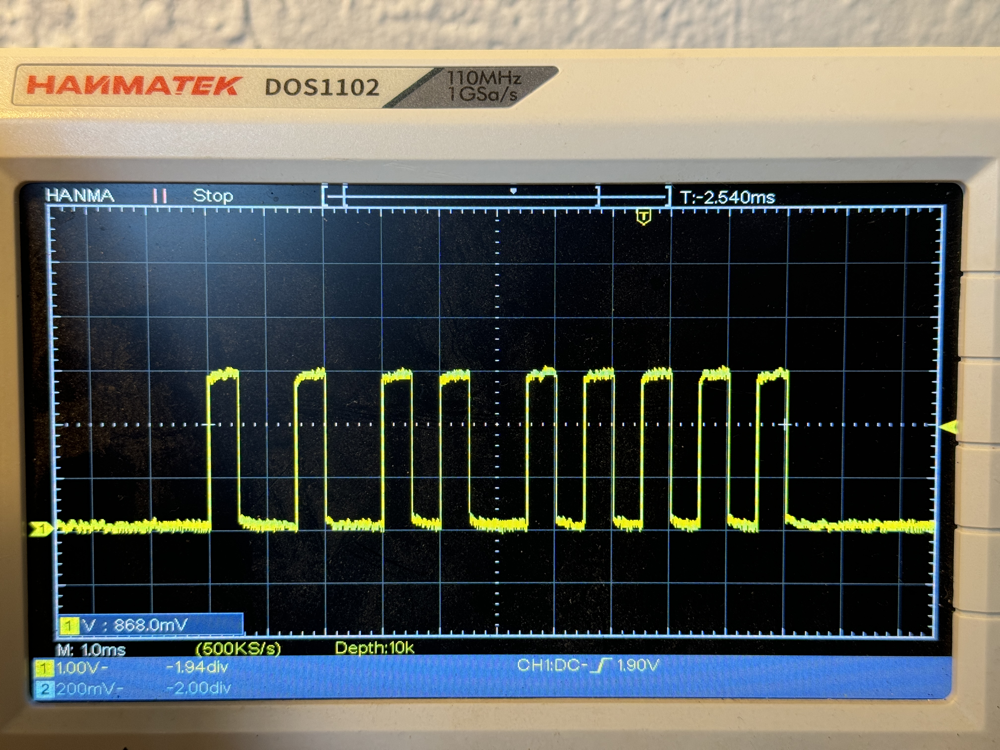

# PPM Generator for the RP2040 using PIO

Based on the work from [Elmot](https://github.com/raspberrypi/pico-examples/pull/414).

This library generates a pulse train commonly used in the RC (remote control) field to communicate between a controller and an external transmitter or a secondary controller.

Here is what the pulse train looks like:

## Utils

Online tool to compile PIO code for the RP2040:

[WOKWI_PIOASM](https://wokwi.com/tools/pioasm)

## Note

`PIO_INTR_SM0_TXNFULL_LSB` was defined in multiple place and was causing build issues, so I replaced it with `pis_sm0_tx_fifo_not_full`.